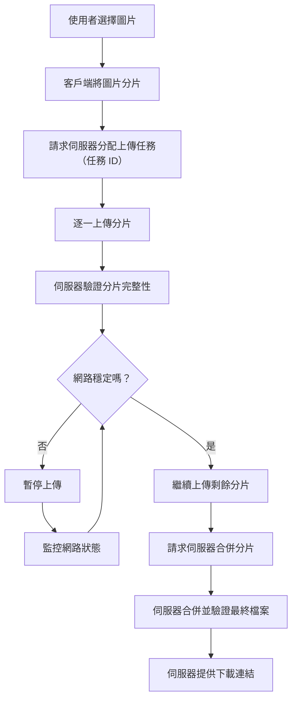

# 在網路不穩定的情況下實現圖片分片上傳系統

這份文件將介紹如何設計一個穩定且可靠的圖片分片上傳系統，尤其是在網路環境不穩定時，確保圖片能順利上傳。以下是完整的功能規格與技術需求。

---

## **功能需求**

### **1. 核心需求**

- 支援大圖片分片上傳。
- 網路中斷後可進行斷點續傳。
- 確保圖片的完整性與安全性。
- 顯示上傳進度條，讓使用者了解進度。
- 同時支持多用戶上傳，保持系統穩定性。

---

## **系統設計概要**

### **用戶端設計**

1. **分片圖片**：

   - 將圖片切成多個小片段，每片大小例如 1MB。
   - 為每個分片生成唯一編號和雜湊值，用於驗證資料正確性。

2. **上傳控制邏輯**：

   - 記錄每個分片的狀態（已完成、上傳中、等待中）。
   - 控制上傳順序，支持串行或並行上傳。
   - 在發生錯誤時自動重試。

3. **進度條與即時回饋**：

   - 計算已完成分片的百分比，更新進度條。
   - 使用者可即時查看上傳狀態（例如：正在上傳第 3/10 個分片）。

### **伺服器設計**

1. **接收與儲存分片**：

   - 驗證每片的雜湊值，確保資料未損壞。
   - 暫時儲存每片資料於伺服器目錄，例如 `/temp` 資料夾。

2. **合併檔案**：

   - 收到所有分片後，按順序合併成完整圖片。
   - 使用 MD5 校驗完整圖片的正確性。

3. **狀態管理**：

   - 儲存每次上傳的任務資訊，例如分片完成情況、上傳時間和用戶 ID。
   - 提供 API 查詢已完成的分片清單。

4. **錯誤與通知機制**：

   - 若有分片遺漏，通知用戶重新上傳。
   - 當多次重試失敗時，記錄錯誤並通知管理員。

### **基礎設施設計**

1. **內容傳遞網路（CDN）**：

   - 上傳完成後，將圖片推送至 CDN 提升下載速度。

2. **分布式儲存**：

   - 使用 AWS S3 或類似的分布式存儲系統，確保資料高可用性。

---

## **系統流程與程式執行流程圖**

## **系統流程**

### **1. 用戶端初始化**

- 使用者選擇圖片後，將其分成多個分片，並計算每片的雜湊值。
- 請求伺服器建立上傳任務，獲取唯一的任務 ID。

### **2. 分片上傳**

- 逐片上傳圖片分片，伺服器驗證每片後返回確認成功訊息。
- 若某片上傳失敗，系統會自動重試。

### **3. 網路中斷處理**

1. **暫停上傳**：
   - 網路中斷時，暫停所有上傳任務。
2. **啟動網路檢測**：
   - 透過 `navigator.onLine` 或伺服器 Ping 檢測網路恢復。
3. **恢復上傳**：
   - 網路恢復後，向伺服器查詢已完成的分片清單。
   - 根據清單跳過已完成分片，繼續上傳剩餘部分。

### **4. 分片合併**

- 當所有分片上傳完成後，用戶端請求伺服器合併分片。
- 伺服器完成合併並驗證完整性，返回圖片 URL。

### **5. 完成通知**

- 用戶可查看上傳成功的圖片連結，或繼續上傳其他檔案。

---

## **注意事項**

### **1. 分片大小建議**

- 網路不穩定時，分片大小設為 512KB。
- 網路穩定時，分片大小可提升至 1MB-5MB。

### **2. 支援斷點續傳**

- 用戶端在上傳前檢查伺服器的已完成分片清單，避免重複上傳。
- 本地記錄每片狀態（完成、失敗、等待中）。

### **3. 網路恢復檢測**

- 使用 `navigator.onLine` 檢查連線狀態，或向伺服器定期發送小型請求。
- 設定合理檢測間隔（如每 3 秒）。

### **4. 資料安全性**

- 使用 HTTPS 保護數據傳輸。
- 為每片分片附加 Token 或驗證資訊。
- 驗證分片的雜湊值，避免資料被篡改。

### **5. 錯誤處理與清理**

- 設定每片的最大重試次數（如 3 次）。
- 對超時未完成的上傳任務進行清理（例如 24 小時後）。

---

## **功能開發摘要**

本規格書詳細描述了圖片分片上傳的功能需求、系統設計與實現流程，適合在不穩定網路環境下提供穩定的上傳服務。開發時需重點關注網路中斷處理、資料安全性與高效的分片管理，確保用戶體驗流暢且系統穩定。

